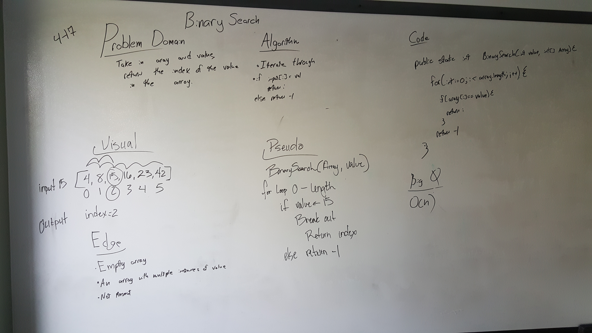

# Reverse an Array
I paired with Michael Jahns on this challenge in class.

This code challenge covered material that was still semi-fresh because it was very similar to one of the challenges in
the lab from this afternoon. We started out using a for loop to loop through the array and then identify whether or not
the value match was available in the array. 

Once I got home I realized that there was the wiki page for the challenge on binary searches and did some more research
on these. I found this (https://www.javatpoint.com/binary-search-in-java) website, among others and used their code as
 an example for my own purposes. 

### Challenge
Write a function called BinarySearch which takes in 2 parameters: a sorted array and the search key. Without utilizing 
any of the built-in methods available to your language, return the index of the array's element that is equal to the
search key, or -1 if the element does not exist.

Example inputs are as follows:

Example 1 Inputs [4, 8, 15, 16, 23, 42]  15 

Example 1 Outputs 2

Example 2 Inputs [11, 22, 33, 44, 55, 66, 77]   90

Example 2 Outputs -1

### Approach & Efficiency
Our approach was to use a for loop within the method to iterate over the array until the value of the input and the
indices were the same. Once the function found these to be equal it would return either the value that was previously
provided or if the value was never found to match anything it would return -1.

I also went ahead and tried to get some of the tests done and the stretch goals within the tests as well. I think that 
I completed these correctly.

The efficiency of this method would be log(n).

### Solution
####(White Board Solution)

