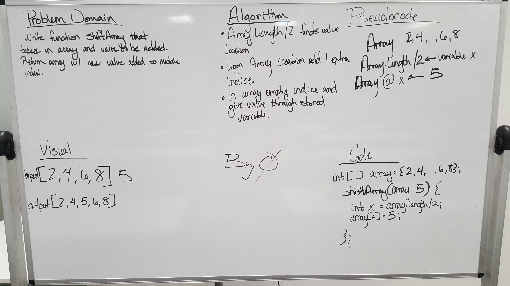

# Reverse an Array
I paired with Nicole Kalbfleisch on this challenge in class.

We started in class by trying to figure out if it was possible to modify the array in place, like we had done with the previous lab. We found out that our initial plan was not going to work and that we would have to return the array with a new array with the additional element and values added.

### Challenge
Write a function called insertShiftArray which takes in an array and the value to be added. Without utilizing any of the built-in methods available to your language, return an array with the new value added at the middle index.

### Approach & Efficiency
My approach that worked differed from the initial plan and whiteboarding because we ended up iterating through the original array until we got to the halfway point. We did this by dividing the length of the array by 2 and then adding in the new element and value. Then we continued on using a new for loop for the final half of the array. Every indices we iterated over on the original array was set to equal the indices of the new array. Finally, we returned the new array for the final output.

### Solution
####(White Board Solution)

