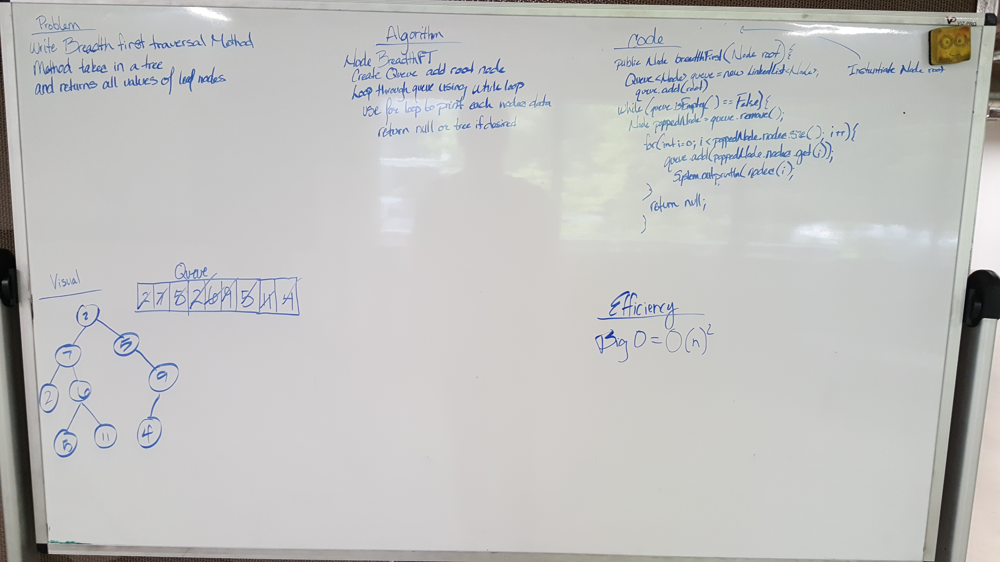

# Breadth First Traversal of Tree
### Lab 16
    - This lab is going to be solved very similarly to how I solved the FizzBuzzTree Challenge. If you would like to see
     that example as well please go to that readme and check out the white board and solution code. Instead of changing
     the values though I will need to print them to the console. The good part is that this method can be used for both 
     binary and non-binary trees.
     
     Sources Used in completing and understanding this lab are as follows:
     https://algorithms.tutorialhorizon.com/breadth-first-searchtraversal-in-a-binary-tree/

### Challenge
    - Write a breadth first traversal method which takes a Binary Tree as its unique input. Without utilizing any of the
      built-in methods available to your language, traverse the input tree using a Breadth-first approach; print every 
      visited node’s value.

### Testing

    - “Happy Path” - Expected outcome
    - Expected failure
    - Edge Case (if applicable/obvious)
    
   
### Approach & Efficiency

FizzBuzzTree Method: O(n)2 because of the while loop and the for loop nested.

My approach was to go online and look up some examples of traversing a tree that was non-binary and then using those 
examples to traverse through th tree touching all nodes within and hopefully changing their value.

### Solution

 
  
 [Breadth First Traversal Code](../src/main/java/Tree/BinaryTree.java)

 
 [Breadth First Traversal Tests](../src/test/java/BinarySearchTreeTest.java)
 

