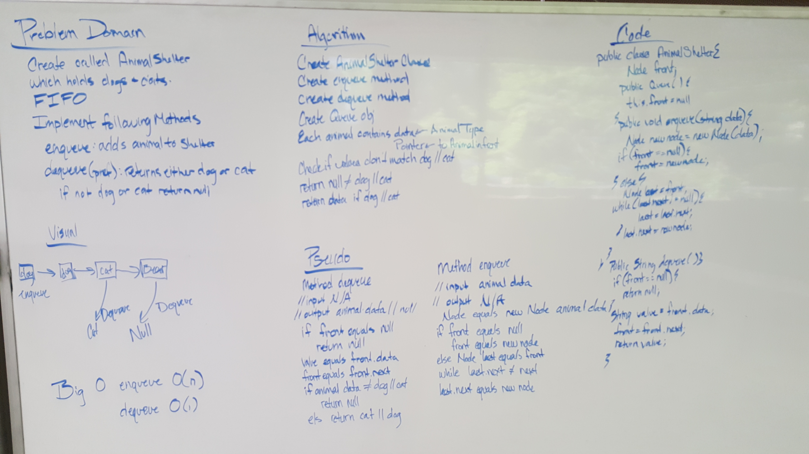

# FIFO Animal Shelter
## Code Challenge12
## Challenge
     - Create a class called AnimalShelter which holds only dogs and cats. The shelter operates using a first-in, first-out approach.
        - Implement the following methods:
            - `enqueue(animal)`: adds `animal` to the shelter. `animal` can be either a dog or a cat object.
            - `dequeue(pref)`: returns either a dog or a cat. If `pref` is not `"dog"` or `"cat"` then return null.

## Approach & Efficiency
    - I went about this initially by attacking this problem similarly to how I went about the original queue problem.
      The biggest difference was that I had to add in an if statement on whether the value/data on the node was equal to
      the allowed dog || cat. If it was then I would return that value, but if it wasn't then I would return null.
      
      **Disclaimer: I just realized that I was suppose to make the cat and dog an object and I have made them strings. 
                    I will go ahead and submit as is and then I will go back and make the dog and cat objects as I
                    believe that this will play hand in hand with the inheritance issue and will be more than just
                    String for object.
                    
    Efficiency
        - Big O for `enqueue`: O(n)
        - Big O for `dequeue`: O(1)
## Solution
[Java Code](/src/main/java/AnimalShelter/FIFOAnimalShelter.java)
#### White Board Solution

