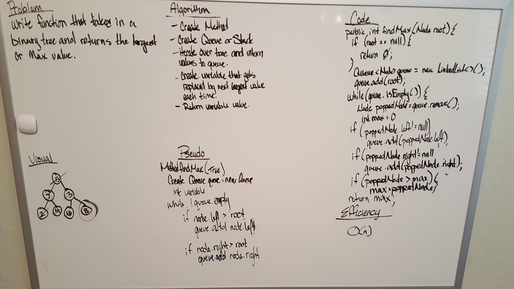

# Breadth First Traversal of Tree
### Challenge 18
    - This lab is going to be very similar to the other traversals except that the next node that the we traverse to 
      will be checked to make sure that it is bigger than its counterpart on the opposite side.
### Challenge
    - Write a function called find-maximum-value which takes binary tree as its only input. Without utilizing any of the
     built-in methods available to your language, return the maximum value stored in the tree. You can assume that the 
     values stored in the Binary Tree will be numeric.

### Testing

    - “Happy Path” - Expected outcome
    - Expected failure
    - Edge Case (if applicable/obvious)
    
   
### Approach & Efficiency

    FizzBuzzTree Method: O(n)2 because of the while loop and the for loop nested.

    My approach was to go online and look up some examples of traversing a tree that was non-binary and then using those 
    examples to traverse through th tree touching all nodes within and hopefully changing their value.

### Solution

 
  
 [Breadth First Traversal Code](../src/main/java/Tree/BinaryTree.java)

 
 [Breadth First Traversal Tests](../src/test/java/BinarySearchTreeTest.java)
 

