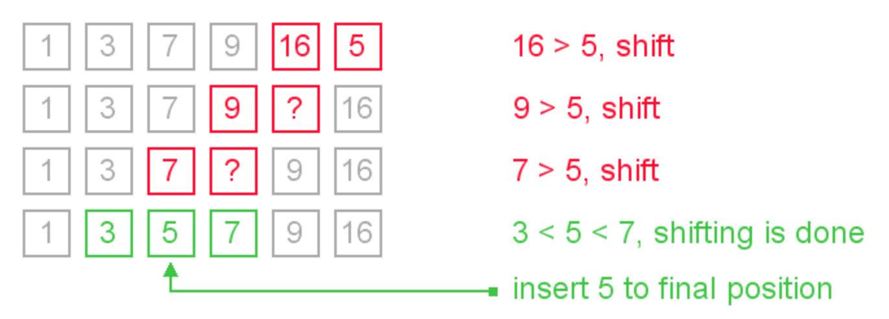
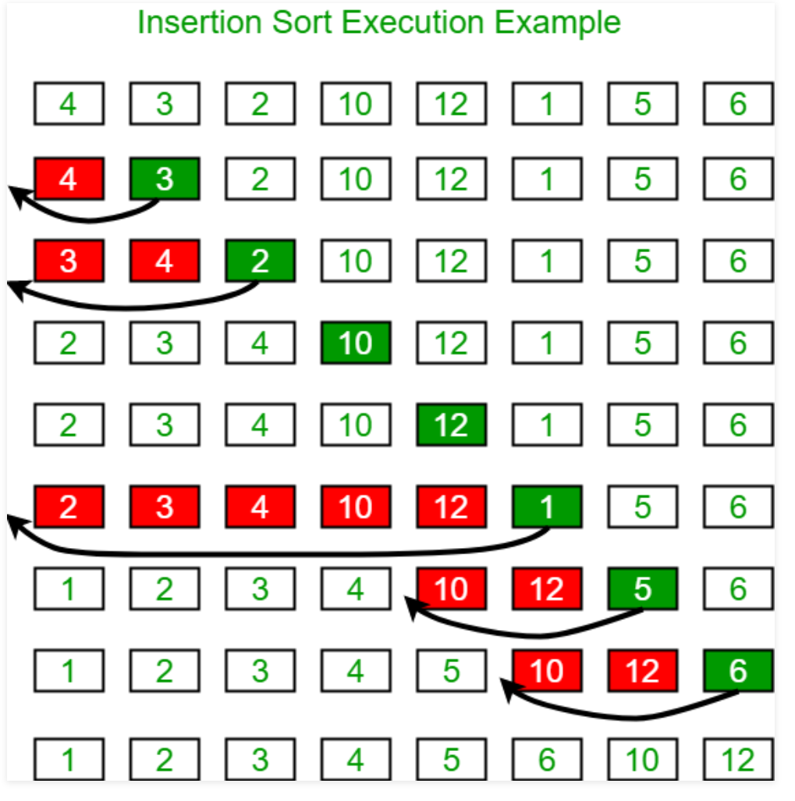
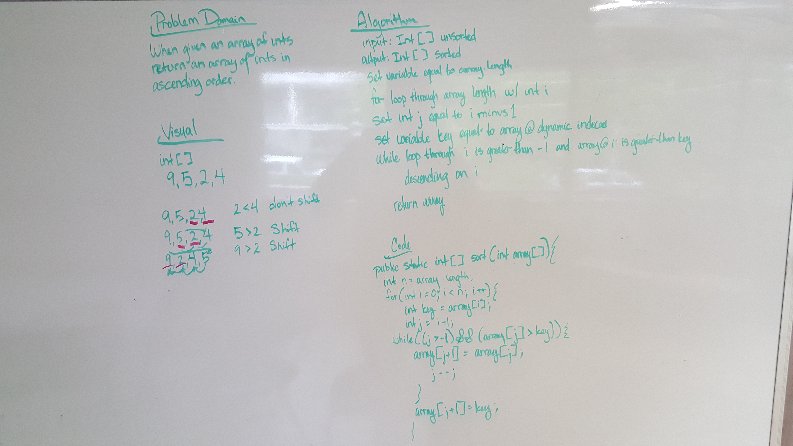

# Code Challenge 26 (Lecture Insertion Sort)

    - An insertion sort takes a data structure, specifically an array in this instance, and loops over each item one at
      a time arranging them in ascending order.
      
    - This method is efficient for small data sets, but since it uses nested loops, may not be the best option for large
      data sets.
      
## Learning Objectives
	- After this lecture, students should have a working understanding of Insertion Sort,
	  reasons for its use, when to use it, when not to use it, and the ability to implement 
	  the sort on their own.
	  

## Lecture Flow

    - Start with the problem domain
    - Continue by showing diagrams and video tutorial
    - Walk through the pseudo code and algorithm
    - Write out actual code
    - Step through the code using visuals similar to the digrams attached with different value examples.

## Diagram

[source](https://www.javatpoint.com/insertion-sort-in-java)

[source](https://www.geeksforgeeks.org/insertion-sort/)

## Algorithm
    See whiteboard picture

## Pseudocode

 `InsertionSort(int[] arr)`
  
    FOR i = 1 to arr.length
    
      int j <-- i - 1
      int temp <-- arr[i]
      
      WHILE j >= 0 AND temp < arr[j]
        arr[j + 1] <-- arr[j]
        j <-- j - 1
        
      arr[j + 1] <-- temp

## Readings and References

#### Watch
Insertion Sort (increasing order video examples)

[Video Example 1](https://www.youtube.com/watch?v=mXA1ICs3K4Y)

[Video Example 2](https://www.youtube.com/watch?v=JU767SDMDvA)

#### Read

[Insertion Sort (Geeks for Geeks)](https://www.geeksforgeeks.org/insertion-sort/)

[Insertion Sort (Java T Point)](https://www.javatpoint.com/insertion-sort-in-java)

#### Bookmark