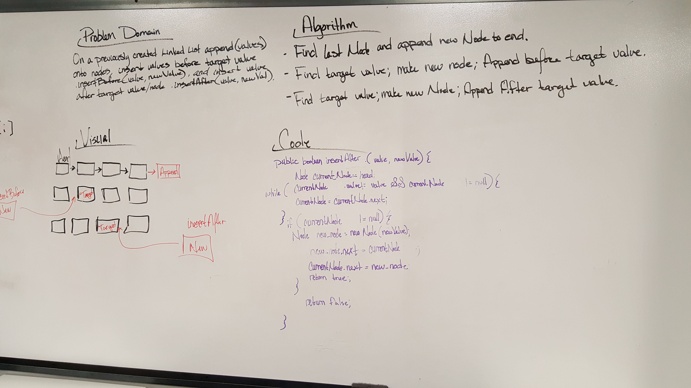
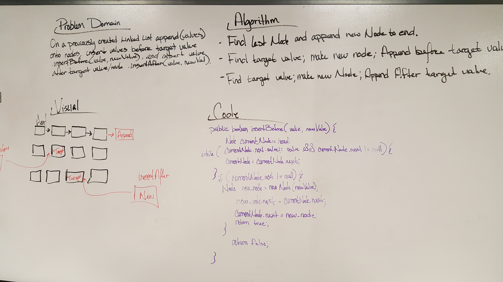
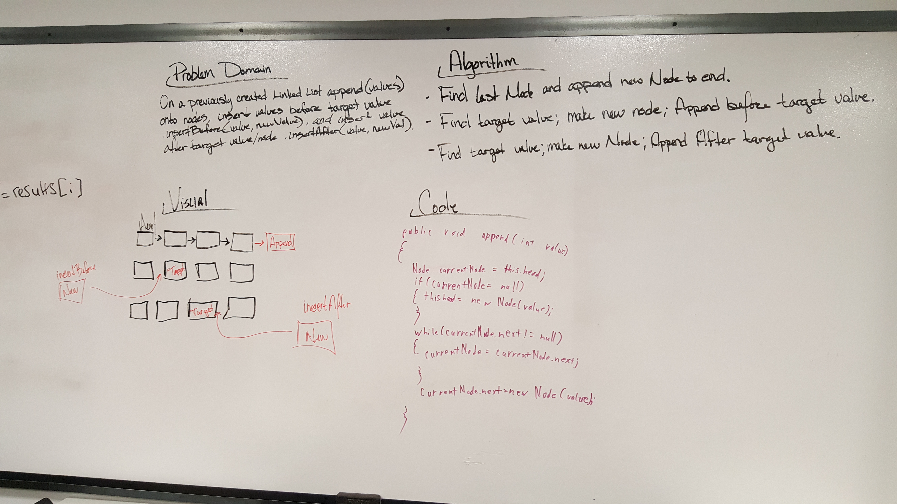

# Linked List Insertions
I paired with Dana on this challenge in class.

    This Code Challenge requires that user is able to find specific nodes within the LinkedList and then either insert new
    Nodes or insert new values into those nodes.

### Challenge
    - .append(value) which adds a new node with the given value to the end of the list
    - .insertBefore(value, newVal) which add a new node with the given newValue immediately before the first value node
    - .insertAfter(value, newVal) which add a new node with the given newValue immediately after the first value node

### Testing

    - Can successfully add a node to the end of the linked list
    - Can successfully add multiple nodes to the end of a linked list
    - Can successfully insert a node before a node located i the middle of a linked list
    - Can successfully insert a node before the first node of a linked list
    - Can successfully insert after a node in the middle of the linked list
    - Can successfully insert a node after the last node of the linked list

### Approach & Efficiency

    This Code Challenge basically built off of the original LinkedList lab05 and added some more methods. It was much
    easier to come back to this and figure out the navigation through the linked list. While the additional methods
    were not easy to implement, I had some more understanding of the .next usage to navigate through the linked list.

### API's

    - .append: The append method adds a new node with a given value to the end of the list. This is the opposite of the 
      insert method that we were using in the last lab. Instead of adding it to the head, we then while loop through the 
      linked list until we find the pointer value of null and then add the node to the end.
    - .insertBefore: This method takes a target value and a new value. It adds a node before the target value and
      changes the pointer to look at that new value.
    - .insertAfter: This method is the opposite of the insertBefore method in that it does the same thing, but adds the 
      new node after the target value.

### Solution
#### (White Board Solution)

