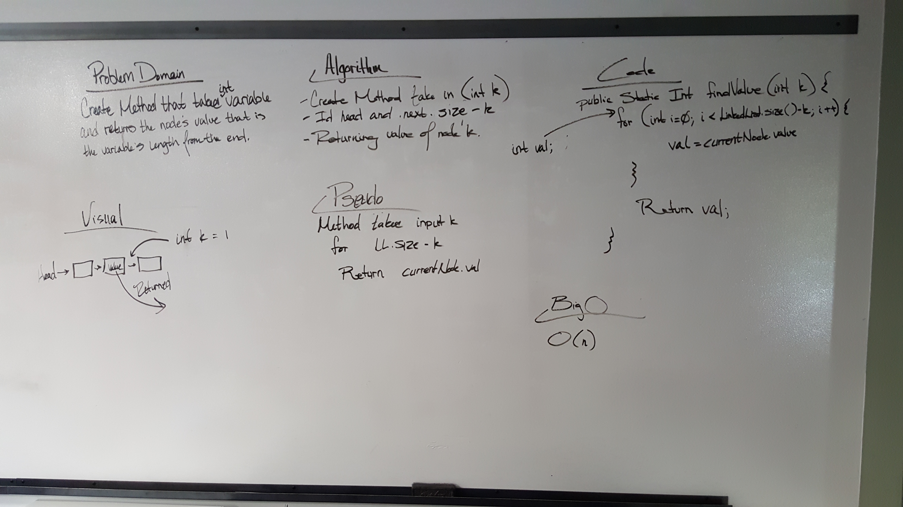

# Linked List kth from the end
I paired with Nicole on this challenge in class.

    This challenge requires that the user write a method that takes in "k" as a variable and then uses that variable to 
    work from the end of the Linked List forward and find the value of the node that is "k" from the end.

### Challenge
    - Write a method for the Linked List class which takes a number, k, as a parameter. Return the node’s value that
     is k from the end of the linked list. You have access to the Node class and all the properties on the Linked List
      class as well as the methods created in previous challenges. 
    
### Approach & Efficiency

    The initial approach that we took was to use variable val to make equal to the value of the specified node once we
    found it using a for loop over the node using LinkedList.size()-k to go in reverse. I have not yet at this time 
    gotten this theory to work.    

### Solution
#### (White Board Solution)

