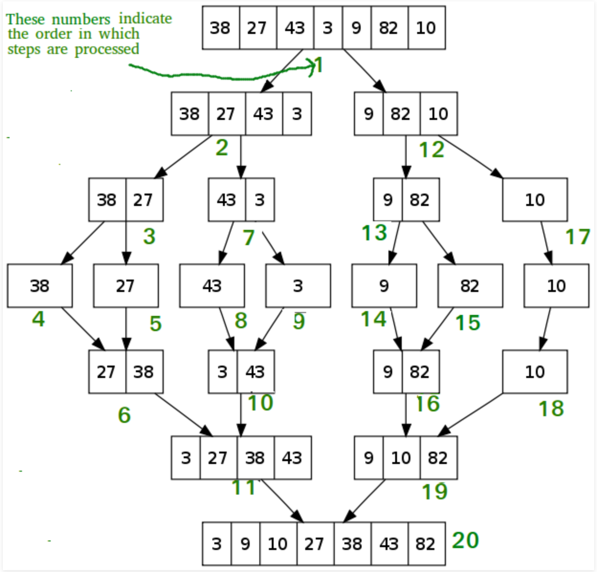

# Code Challenge 27 (Lecture Merge Sort Algorithm)

    - An merge sort takes a data structure, specifically an array 'ints' in this instance, and loops through the initial
      array, splitting it into two separate arrays.
      
    - Each new array then gets sorted against the other 'ints' within that array.
      
    - The two new arrays are then merged back into a single array and 'ints' from each of these arrays are sorted against
      each other before being added into the single array again.
      
    - This method is efficient for small data sets, but since it uses nested loops, may not be the best option for large
      data sets.
      
## Learning Objectives

	- After this lecture, students should have a working understanding of Merge Sort,
	  reasons for its use, when to use it, when not to use it, and the ability to implement 
	  the sort on their own.
	  

## Lecture Flow

    - Start with the problem domain
    - Continue by showing diagrams and video tutorial
    - Walk through the pseudo code and algorithm
    - Write out actual code
    - Step through the code using visuals similar to the digrams attached with different value examples.

## Diagram

[source](https://www.geeksforgeeks.org/merge-sort/)

[source](https://www.baeldung.com/java-merge-sort)

## Algorithm & Pseudocode

 InsertionSort(int[] arr)
  
    FOR i = 1 to arr.length
    
      int j <-- i - 1
      int temp <-- arr[i]
      
      WHILE j >= 0 AND temp < arr[j]
        arr[j + 1] <-- arr[j]
        j <-- j - 1
        
      arr[j + 1] <-- temp

## Readings and References

#### Watch
Merge Sort (ascending order video examples)

[Video Example 1](https://www.youtube.com/watch?v=iMT7gTPpaqw)

[Video Example 2](https://www.youtube.com/watch?v=KF2j-9iSf4Q)

#### Read

[Merge Sort (Geeks for Geeks)](https://www.geeksforgeeks.org/merge-sort/)

[Merge Sort(Baeldung)](https://www.baeldung.com/java-merge-sort)

#### Bookmark

[code solution](/src/main/java/MergeSort/MergeSort.java)