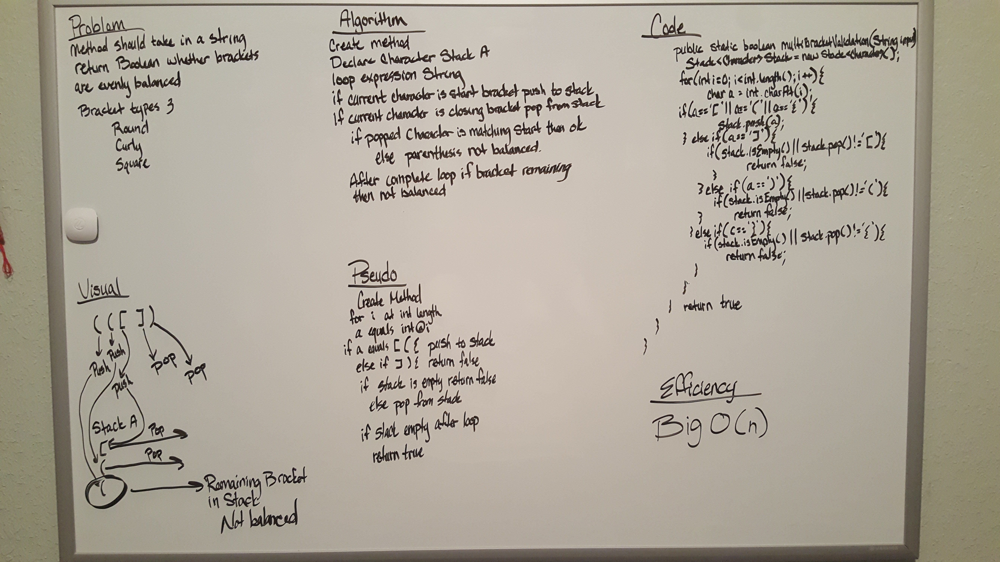

# Reverse an Array
### Code Challenge 13

## Challenge

    - Your function should take a string as its only argument, and should return a boolean representing whether or not
      the brackets in the string are balanced.
    - There are 3 types of brackets:
        - Round Brackets : `()`
        - Square Brackets : `[]`
        - Curly Brackets : `{}`

## Approach & Efficiency
    - I knew from the beginning that I was going to have to loop through the string and then identify the brackets.
      Since we have recently been using node lists, I was wondering if using a list would work. After drawing it out in
      a queue I didn't think this would work, but the stack method seemed like it had some functionality. Looking online
      for some help and inspiration confirmed my view of the stack working well. I went ahead and worked my way through
      the problem using some help along the way from the Geeksforgeeks website and stack overflow to make sure that I
      was on the right track to proper completion.
      
      - Resources used for information on the challenge
        - https://stackoverflow.com/questions/23187539/java-balanced-expressions-check
        - https://www.geeksforgeeks.org/check-for-balanced-parentheses-in-an-expression/

    - Efficiency
        - Big O(n)
            This is because we are only looping through the string once. Everything else that is done is done in tandem 
            with this single loop.
## Solution
#### White Board Solution

