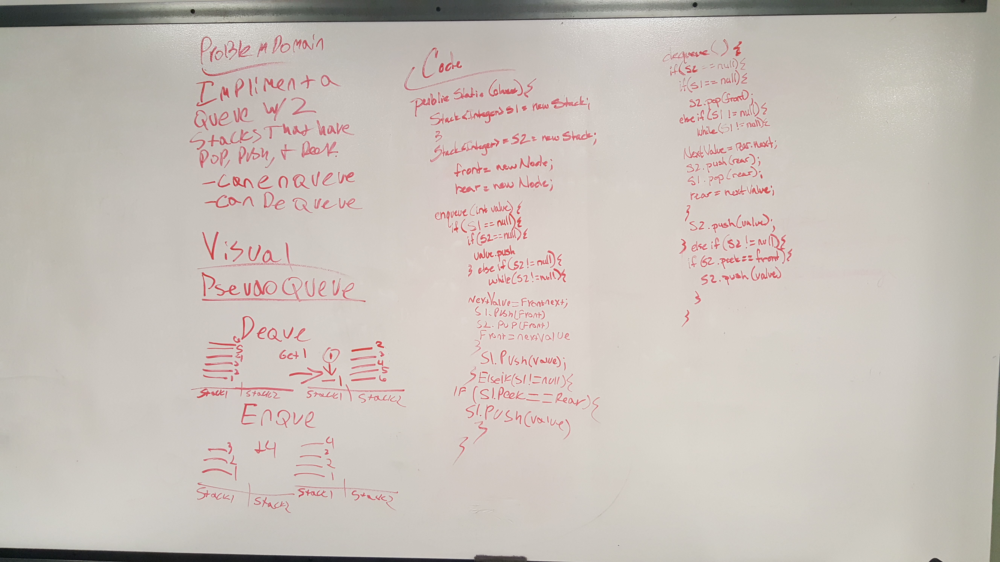
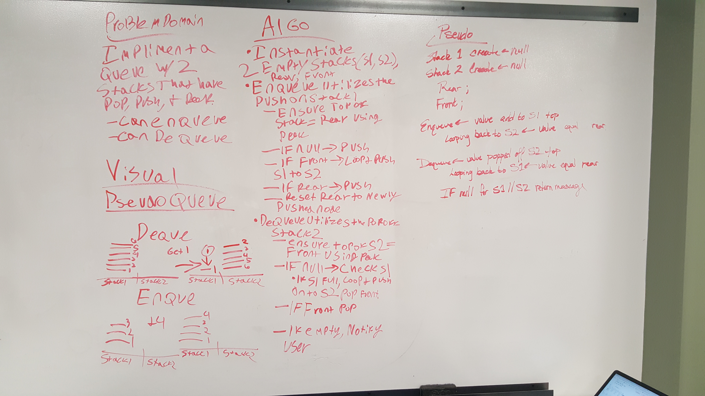

# Queue With Stacks
## Challenge 11

## Challenge
    
    - Create a brand new PseudoQueue class. Do not use an existing Queue. Instead, this PseudoQueue class will implement
     our standard queue interface (the two methods listed below), but will internally only utilize 2 Stack objects. 
     Ensure that you create your class with the following methods:
        - enqueue(value) which inserts value into the PseudoQueue, using a first-in, first-out approach.
        - dequeue() which extracts a value from the PseudoQueue, using a first-in, first-out approach.
    - The Stack instances have only push, pop, and peek methods. You should use your own Stack implementation. 
     Instantiate these Stack objects in your PseudoQueue constructor.
    
## Testing

    1. “Happy Path” - Expected outcome
    2. Expected failure
    3. Edge Case (if applicable/obvious)

    Ensure your tests are passing before you submit your solution.

## Approach & Efficiency
    
    We started by drawing out the problem in a white boarding session. I was still not very sure of the problem in
    class and once I got home I started doing some searching online to try and understand the problem better. I went
    ahead and started working on this and figure out that if you are trying to add to the Queue and the front was facing 
    you, then you need to pop and push all of the items to the other stack before you can then add the new node and 
    value to the stack. This works the same if you are trying the take a node off of the stack. 

## Solution
### White Board Solution

 

