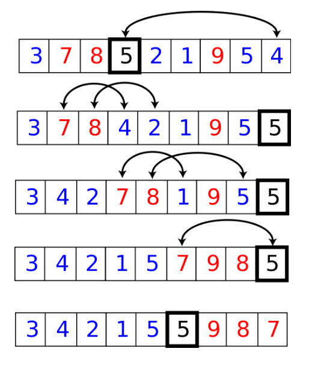
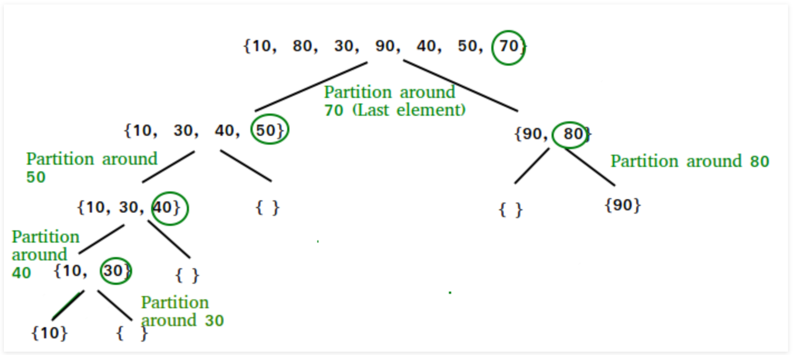

# Code Challenge 27 (Lecture Merge Sort Algorithm)

    - Quick Sort is similar to merge sort in that it also divides that data and then sorts it out. There are many
      ways to implement Quick Sort and below are a few of the methods. In each of them, a specific element is picked
      and then partitions all of the other elements in the array around that specific pivot element.
            - First element as the pivot element
            - Last element as the pivot element
            - Random element as the pivot element
            - Median element as the pivot element
    - All of the methods have the same sorting method in common, just different starting points. All elements smaller
      than the pivot element are placed before the pivot, while all elements that are bigger than the pivot element are
      placed behind it.
    - This should all be completed in linear time.
      
## Learning Objectives

	- After this lecture, students should have a working understanding of Quick Sort,
	  reasons for its use, when to use it, when not to use it, and the ability to implement 
	  the sort on their own.
	  

## Lecture Flow

    - Start with the problem domain
    - Continue by showing diagrams and video tutorial
    - Walk through the pseudo code and algorithm
    - Write out actual code
    - Step through the code using visuals similar to the digrams attached with different value examples.

## Diagram

[source](https://java2novice.com/java-sorting-algorithms/quick-sort/)

[source](https://www.geeksforgeeks.org/quick-sort/)

**********************************************
//Put my WhiteBoard here

## Algorithm

***********************************************  

## Pseudocode

*There was no pseudo code provided as specified in the instructions*

    /* low  --> Starting index,  high  --> Ending index */
    quickSort(arr[], low, high)
    {
        if (low < high)
        {
            /* pi is partitioning index, arr[p] is now
               at right place */
            pi = partition(arr, low, high);
    
            quickSort(arr, low, pi - 1);  // Before pi
            quickSort(arr, pi + 1, high); // After pi
        }
    }

## Readings and References

#### Watch

Quick Sort

[Video Example 1](https://www.youtube.com/watch?v=Fiot5yuwPAg)

[Video Example 2](https://djitz.com/guides/quick-sort-algorithm-in-java/)

[Video Example 3](https://dzone.com/articles/quicksort-easy-way)

#### Read

[Quick Sort (Java 2 Novice)](https://java2novice.com/java-sorting-algorithms/quick-sort/)

[Quick Sort(Geeks for Geeks)](https://www.geeksforgeeks.org/quick-sort/)

#### Bookmark

[code solution](/src/main/java/QuickSort/QuickSort.java)